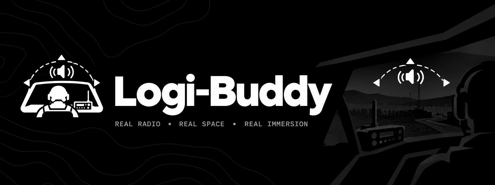

# LogiBuddy

LogiBuddy turns any audio source on your PC — Spotify, a browser tab, Discord,
whatever — into an immersive, spatialized in-vehicle radio for sim and milsim
games. It captures the source's audio, runs it through a filter chain that
makes it sound like a tinny in-cabin radio, and places it at a fixed point in
3D space. When you free-look in-game (holding a hotkey and moving the mouse),
the audio image rotates the way a real, fixed radio would — the sound gets
quieter and shifts behind you as you turn away from it, just like it would if
there were an actual speaker mounted on the dash.

Built for games like Arma, where "radio chatter" or music playing flat over
the top of the game audio breaks immersion, and a real in-vehicle radio
feeling is worth the setup effort.

## How it works

- **Capture** — grabs the audio of a process you pick from a dropdown
  (Spotify, a browser, Discord, etc.) via per-process WASAPI loopback, with
  an automatic whole-device fallback on older Windows or when per-process
  capture fails at runtime.
- **Tone shaping** — a small DSP chain (high/low-pass filter, soft-clip
  distortion, compressor, static/noise, wet/dry mix, volume, stereo width)
  makes the source sound like it's coming out of a real vehicle radio
  instead of a clean digital source.
- **Spatialization** — true HRTF 3D audio via Steam Audio (`phonon.dll`)
  when available, with an automatic stereo-panning fallback when it isn't.
  The source sits at a point you place on-screen; a separate "outside view"
  mode orbits the listener around a centred source with its own tuning
  (low-pass, volume, width, distance) for a third-person vehicle view.
- **Freelook tracking** — while you hold a hotkey and move the mouse, raw
  mouse deltas are used to estimate your in-game look angle and rotate the
  audio image to match. This is an approximation tuned by a short
  calibration step, not a memory read — LogiBuddy never touches the game
  process. It's an external, input-hook-based tool, the same risk class as
  AutoHotkey or a voice-chat push-to-talk utility, not a memory-reading or
  injection-based tool.
- **Vehicle toggle** — simulates getting in/out of a vehicle: tap (or hold)
  a hotkey to mute/un-mute the radio after a configurable delay, matching
  games that play an exit/enter-vehicle animation.
- **Source routing** — routes the source app's own Windows audio output to
  a silent virtual device while running, so you hear only the processed
  radio and not the raw source playing underneath it. This is not a nice-to-have:
  without it, you hear both the unprocessed source and the processed radio
  overlapping at once, which defeats the entire effect (see
  [Requirements](#requirements)).
- **Voice chat transcription** — hold a hotkey to record from your
  microphone, release to transcribe locally (Whisper) and copy the result
  to your clipboard automatically, with a custom-vocabulary list to bias
  transcription toward callsigns and unit-specific jargon.
- **Profiles** — save and load named sets of all the above.

None of this reads game memory, injects into a process, or hooks a game in
any way — it only reads global mouse/keyboard input and captures audio via
standard Windows APIs, the same way any other external overlay/macro tool
does.

## Requirements

- **Windows 10 20H1 (build 19041) or later** for per-process audio capture.
  Older Windows (or a machine where per-process capture fails at runtime)
  falls back to whole-device capture automatically, with a one-line notice.
- **.NET 8** — the Desktop Runtime to run a release build, or the SDK to
  build/run from source.
- **`phonon.dll`** (Steam Audio's native HRTF library, Apache-2.0 licensed)
  for true 3D spatialization:
  - Already bundled in the release ZIP next to the `.exe` — nothing to do.
  - Building from source: run `./build/fetch-phonon.ps1` once (see
    [Building from source](#building-from-source) below).
  - Without it, LogiBuddy still runs, just with simple stereo panning
    instead of true HRTF.
- **A virtual audio cable (VB-Audio Virtual Cable, VoiceMeeter, etc.) — required
  for the intended experience, not optional.** Without one, you hear the raw
  source *and* the processed radio playing at once, overlapping — muting the
  source instead is not a workaround, since LogiBuddy captures that same
  session, so muting it also silences the radio. A virtual cable gives the
  source somewhere silent to go instead.
  - LogiBuddy's own "auto-route source to a silent device" automates picking
    the cable and routing to it, but that automation needs **Windows 11**
    (an undocumented API not available on Windows 10).
  - On Windows 10, route the source manually instead: Windows Settings →
    System → Sound → "App volume and device preferences" → set the source
    app's output to the virtual cable. One-time setup, works every launch.

## Getting started (end users)

Grab either from the [Releases page](https://github.com/TomDdotExe/LogiBuddy/releases):

- **Installer** (`LogiBuddy-vX.Y.Z-win-x64-setup.exe`) — installs to
  `%LocalAppData%\Programs\LogiBuddy` with a Start Menu entry and a
  proper uninstaller. No admin rights needed.
- **Portable ZIP** (`LogiBuddy-vX.Y.Z-win-x64.zip`) — unzip anywhere and
  run `LogiBuddy.exe` directly, no install step.

Then follow the first-time setup below (or the fuller walkthrough in
[`docs/SETUP.md`](docs/SETUP.md)).

## First-time setup

1. Start your audio source (Spotify, a browser tab, etc.) and begin playback.
2. Launch LogiBuddy, click **Refresh**, and select your source from the
   dropdown.
3. Drag the orange marker on the position canvas to where you want the radio
   to sound like it's coming from (e.g. slightly right and ahead, for a
   dashboard-mounted radio).
4. Set your freelook hotkey to match your game's freelook key, then run
   **Calibrate freelook** while playing: face forward, turn to your game's
   turn limit, and tap the calibrate hotkey — this sets mouse sensitivity
   automatically.
5. Optionally bind a Recenter hotkey and a Vehicle toggle hotkey.
6. Click **Start**, then hold your freelook key and look around in-game —
   the radio audio should shift as if it were mounted in the vehicle.
7. Click **Save Profile** to keep these settings for next time.

See [`docs/SETUP.md`](docs/SETUP.md) for the full walkthrough, real-time vs.
restart-required settings, source routing/muting details, and known
limitations.

## Building from source

Requirements: .NET 8 SDK, Windows.

```powershell
git clone https://github.com/TomDdotExe/LogiBuddy.git
cd LogiBuddy
./build/fetch-phonon.ps1        # once, to fetch phonon.dll for HRTF
dotnet run --project src/LogiBuddy.App/LogiBuddy.App.csproj
```

Run the test suite with:

```powershell
dotnet test LogiBuddy.sln
```

To cut a release ZIP, see [`build/README.md`](build/README.md).

## License

LogiBuddy's own source has no license file yet — treat it as all-rights-reserved
until one is added.

Steam Audio (`phonon.dll`) is bundled under the **Apache License 2.0**; the
release ZIP includes the full license text and third-party notices in
`THIRD-PARTY-NOTICES.txt`.
